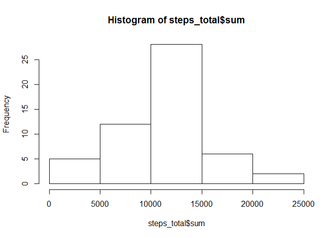
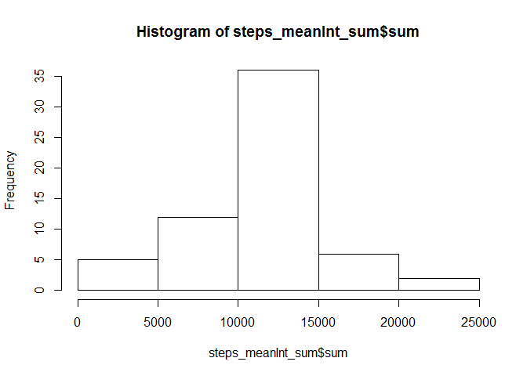

# Reproducible Research: Peer Assessment 1
##Load packages

```r
library(dplyr)    
```

```
## 
## Attaching package: 'dplyr'
```

```
## The following objects are masked from 'package:stats':
## 
##     filter, lag
```

```
## The following objects are masked from 'package:base':
## 
##     intersect, setdiff, setequal, union
```

## Loading and preprocessing the data

```r
setwd("D:/New_folder/RepData_PeerAssessment1/")

steps <- read.csv("activity.csv")

steps$date <- as.Date(as.character(steps$date))
steps$date <- format(steps$date, "%m/%d/%y")

str(steps)
```

```
## 'data.frame':	17568 obs. of  3 variables:
##  $ steps   : int  NA NA NA NA NA NA NA NA NA NA ...
##  $ date    : chr  "10/01/12" "10/01/12" "10/01/12" "10/01/12" ...
##  $ interval: int  0 5 10 15 20 25 30 35 40 45 ...
```

## What is mean total number of steps taken per day?

```r
library(xtable)
```

```
## Warning: package 'xtable' was built under R version 3.3.2
```

```r
steps_total <- steps %>%
  group_by(date) %>%
  summarize(sum = sum(steps))

hist(steps_total$sum)
```

<!-- -->

```r
steps_mean <- steps %>%
  group_by(date) %>%
  summarize(mean = mean(steps))

stepsmean_table <- xtable(steps_mean)

print(stepsmean_table, type = "html")
```

<!-- html table generated in R 3.3.1 by xtable 1.8-2 package -->
<!-- Wed Jan 25 15:48:49 2017 -->
<table border=1>
<tr> <th>  </th> <th> date </th> <th> mean </th>  </tr>
  <tr> <td align="right"> 1 </td> <td> 10/01/12 </td> <td align="right">  </td> </tr>
  <tr> <td align="right"> 2 </td> <td> 10/02/12 </td> <td align="right"> 0.44 </td> </tr>
  <tr> <td align="right"> 3 </td> <td> 10/03/12 </td> <td align="right"> 39.42 </td> </tr>
  <tr> <td align="right"> 4 </td> <td> 10/04/12 </td> <td align="right"> 42.07 </td> </tr>
  <tr> <td align="right"> 5 </td> <td> 10/05/12 </td> <td align="right"> 46.16 </td> </tr>
  <tr> <td align="right"> 6 </td> <td> 10/06/12 </td> <td align="right"> 53.54 </td> </tr>
  <tr> <td align="right"> 7 </td> <td> 10/07/12 </td> <td align="right"> 38.25 </td> </tr>
  <tr> <td align="right"> 8 </td> <td> 10/08/12 </td> <td align="right">  </td> </tr>
  <tr> <td align="right"> 9 </td> <td> 10/09/12 </td> <td align="right"> 44.48 </td> </tr>
  <tr> <td align="right"> 10 </td> <td> 10/10/12 </td> <td align="right"> 34.38 </td> </tr>
  <tr> <td align="right"> 11 </td> <td> 10/11/12 </td> <td align="right"> 35.78 </td> </tr>
  <tr> <td align="right"> 12 </td> <td> 10/12/12 </td> <td align="right"> 60.35 </td> </tr>
  <tr> <td align="right"> 13 </td> <td> 10/13/12 </td> <td align="right"> 43.15 </td> </tr>
  <tr> <td align="right"> 14 </td> <td> 10/14/12 </td> <td align="right"> 52.42 </td> </tr>
  <tr> <td align="right"> 15 </td> <td> 10/15/12 </td> <td align="right"> 35.20 </td> </tr>
  <tr> <td align="right"> 16 </td> <td> 10/16/12 </td> <td align="right"> 52.38 </td> </tr>
  <tr> <td align="right"> 17 </td> <td> 10/17/12 </td> <td align="right"> 46.71 </td> </tr>
  <tr> <td align="right"> 18 </td> <td> 10/18/12 </td> <td align="right"> 34.92 </td> </tr>
  <tr> <td align="right"> 19 </td> <td> 10/19/12 </td> <td align="right"> 41.07 </td> </tr>
  <tr> <td align="right"> 20 </td> <td> 10/20/12 </td> <td align="right"> 36.09 </td> </tr>
  <tr> <td align="right"> 21 </td> <td> 10/21/12 </td> <td align="right"> 30.63 </td> </tr>
  <tr> <td align="right"> 22 </td> <td> 10/22/12 </td> <td align="right"> 46.74 </td> </tr>
  <tr> <td align="right"> 23 </td> <td> 10/23/12 </td> <td align="right"> 30.97 </td> </tr>
  <tr> <td align="right"> 24 </td> <td> 10/24/12 </td> <td align="right"> 29.01 </td> </tr>
  <tr> <td align="right"> 25 </td> <td> 10/25/12 </td> <td align="right"> 8.65 </td> </tr>
  <tr> <td align="right"> 26 </td> <td> 10/26/12 </td> <td align="right"> 23.53 </td> </tr>
  <tr> <td align="right"> 27 </td> <td> 10/27/12 </td> <td align="right"> 35.14 </td> </tr>
  <tr> <td align="right"> 28 </td> <td> 10/28/12 </td> <td align="right"> 39.78 </td> </tr>
  <tr> <td align="right"> 29 </td> <td> 10/29/12 </td> <td align="right"> 17.42 </td> </tr>
  <tr> <td align="right"> 30 </td> <td> 10/30/12 </td> <td align="right"> 34.09 </td> </tr>
  <tr> <td align="right"> 31 </td> <td> 10/31/12 </td> <td align="right"> 53.52 </td> </tr>
  <tr> <td align="right"> 32 </td> <td> 11/01/12 </td> <td align="right">  </td> </tr>
  <tr> <td align="right"> 33 </td> <td> 11/02/12 </td> <td align="right"> 36.81 </td> </tr>
  <tr> <td align="right"> 34 </td> <td> 11/03/12 </td> <td align="right"> 36.70 </td> </tr>
  <tr> <td align="right"> 35 </td> <td> 11/04/12 </td> <td align="right">  </td> </tr>
  <tr> <td align="right"> 36 </td> <td> 11/05/12 </td> <td align="right"> 36.25 </td> </tr>
  <tr> <td align="right"> 37 </td> <td> 11/06/12 </td> <td align="right"> 28.94 </td> </tr>
  <tr> <td align="right"> 38 </td> <td> 11/07/12 </td> <td align="right"> 44.73 </td> </tr>
  <tr> <td align="right"> 39 </td> <td> 11/08/12 </td> <td align="right"> 11.18 </td> </tr>
  <tr> <td align="right"> 40 </td> <td> 11/09/12 </td> <td align="right">  </td> </tr>
  <tr> <td align="right"> 41 </td> <td> 11/10/12 </td> <td align="right">  </td> </tr>
  <tr> <td align="right"> 42 </td> <td> 11/11/12 </td> <td align="right"> 43.78 </td> </tr>
  <tr> <td align="right"> 43 </td> <td> 11/12/12 </td> <td align="right"> 37.38 </td> </tr>
  <tr> <td align="right"> 44 </td> <td> 11/13/12 </td> <td align="right"> 25.47 </td> </tr>
  <tr> <td align="right"> 45 </td> <td> 11/14/12 </td> <td align="right">  </td> </tr>
  <tr> <td align="right"> 46 </td> <td> 11/15/12 </td> <td align="right"> 0.14 </td> </tr>
  <tr> <td align="right"> 47 </td> <td> 11/16/12 </td> <td align="right"> 18.89 </td> </tr>
  <tr> <td align="right"> 48 </td> <td> 11/17/12 </td> <td align="right"> 49.79 </td> </tr>
  <tr> <td align="right"> 49 </td> <td> 11/18/12 </td> <td align="right"> 52.47 </td> </tr>
  <tr> <td align="right"> 50 </td> <td> 11/19/12 </td> <td align="right"> 30.70 </td> </tr>
  <tr> <td align="right"> 51 </td> <td> 11/20/12 </td> <td align="right"> 15.53 </td> </tr>
  <tr> <td align="right"> 52 </td> <td> 11/21/12 </td> <td align="right"> 44.40 </td> </tr>
  <tr> <td align="right"> 53 </td> <td> 11/22/12 </td> <td align="right"> 70.93 </td> </tr>
  <tr> <td align="right"> 54 </td> <td> 11/23/12 </td> <td align="right"> 73.59 </td> </tr>
  <tr> <td align="right"> 55 </td> <td> 11/24/12 </td> <td align="right"> 50.27 </td> </tr>
  <tr> <td align="right"> 56 </td> <td> 11/25/12 </td> <td align="right"> 41.09 </td> </tr>
  <tr> <td align="right"> 57 </td> <td> 11/26/12 </td> <td align="right"> 38.76 </td> </tr>
  <tr> <td align="right"> 58 </td> <td> 11/27/12 </td> <td align="right"> 47.38 </td> </tr>
  <tr> <td align="right"> 59 </td> <td> 11/28/12 </td> <td align="right"> 35.36 </td> </tr>
  <tr> <td align="right"> 60 </td> <td> 11/29/12 </td> <td align="right"> 24.47 </td> </tr>
  <tr> <td align="right"> 61 </td> <td> 11/30/12 </td> <td align="right">  </td> </tr>
   </table>

```r
steps_median <- steps %>%
  group_by(date) %>%
  summarize(median = median(steps))

stepsmedian_table <- xtable(steps_median)

print(stepsmedian_table, type="html")
```

<!-- html table generated in R 3.3.1 by xtable 1.8-2 package -->
<!-- Wed Jan 25 15:48:49 2017 -->
<table border=1>
<tr> <th>  </th> <th> date </th> <th> median </th>  </tr>
  <tr> <td align="right"> 1 </td> <td> 10/01/12 </td> <td align="right">  </td> </tr>
  <tr> <td align="right"> 2 </td> <td> 10/02/12 </td> <td align="right"> 0.00 </td> </tr>
  <tr> <td align="right"> 3 </td> <td> 10/03/12 </td> <td align="right"> 0.00 </td> </tr>
  <tr> <td align="right"> 4 </td> <td> 10/04/12 </td> <td align="right"> 0.00 </td> </tr>
  <tr> <td align="right"> 5 </td> <td> 10/05/12 </td> <td align="right"> 0.00 </td> </tr>
  <tr> <td align="right"> 6 </td> <td> 10/06/12 </td> <td align="right"> 0.00 </td> </tr>
  <tr> <td align="right"> 7 </td> <td> 10/07/12 </td> <td align="right"> 0.00 </td> </tr>
  <tr> <td align="right"> 8 </td> <td> 10/08/12 </td> <td align="right">  </td> </tr>
  <tr> <td align="right"> 9 </td> <td> 10/09/12 </td> <td align="right"> 0.00 </td> </tr>
  <tr> <td align="right"> 10 </td> <td> 10/10/12 </td> <td align="right"> 0.00 </td> </tr>
  <tr> <td align="right"> 11 </td> <td> 10/11/12 </td> <td align="right"> 0.00 </td> </tr>
  <tr> <td align="right"> 12 </td> <td> 10/12/12 </td> <td align="right"> 0.00 </td> </tr>
  <tr> <td align="right"> 13 </td> <td> 10/13/12 </td> <td align="right"> 0.00 </td> </tr>
  <tr> <td align="right"> 14 </td> <td> 10/14/12 </td> <td align="right"> 0.00 </td> </tr>
  <tr> <td align="right"> 15 </td> <td> 10/15/12 </td> <td align="right"> 0.00 </td> </tr>
  <tr> <td align="right"> 16 </td> <td> 10/16/12 </td> <td align="right"> 0.00 </td> </tr>
  <tr> <td align="right"> 17 </td> <td> 10/17/12 </td> <td align="right"> 0.00 </td> </tr>
  <tr> <td align="right"> 18 </td> <td> 10/18/12 </td> <td align="right"> 0.00 </td> </tr>
  <tr> <td align="right"> 19 </td> <td> 10/19/12 </td> <td align="right"> 0.00 </td> </tr>
  <tr> <td align="right"> 20 </td> <td> 10/20/12 </td> <td align="right"> 0.00 </td> </tr>
  <tr> <td align="right"> 21 </td> <td> 10/21/12 </td> <td align="right"> 0.00 </td> </tr>
  <tr> <td align="right"> 22 </td> <td> 10/22/12 </td> <td align="right"> 0.00 </td> </tr>
  <tr> <td align="right"> 23 </td> <td> 10/23/12 </td> <td align="right"> 0.00 </td> </tr>
  <tr> <td align="right"> 24 </td> <td> 10/24/12 </td> <td align="right"> 0.00 </td> </tr>
  <tr> <td align="right"> 25 </td> <td> 10/25/12 </td> <td align="right"> 0.00 </td> </tr>
  <tr> <td align="right"> 26 </td> <td> 10/26/12 </td> <td align="right"> 0.00 </td> </tr>
  <tr> <td align="right"> 27 </td> <td> 10/27/12 </td> <td align="right"> 0.00 </td> </tr>
  <tr> <td align="right"> 28 </td> <td> 10/28/12 </td> <td align="right"> 0.00 </td> </tr>
  <tr> <td align="right"> 29 </td> <td> 10/29/12 </td> <td align="right"> 0.00 </td> </tr>
  <tr> <td align="right"> 30 </td> <td> 10/30/12 </td> <td align="right"> 0.00 </td> </tr>
  <tr> <td align="right"> 31 </td> <td> 10/31/12 </td> <td align="right"> 0.00 </td> </tr>
  <tr> <td align="right"> 32 </td> <td> 11/01/12 </td> <td align="right">  </td> </tr>
  <tr> <td align="right"> 33 </td> <td> 11/02/12 </td> <td align="right"> 0.00 </td> </tr>
  <tr> <td align="right"> 34 </td> <td> 11/03/12 </td> <td align="right"> 0.00 </td> </tr>
  <tr> <td align="right"> 35 </td> <td> 11/04/12 </td> <td align="right">  </td> </tr>
  <tr> <td align="right"> 36 </td> <td> 11/05/12 </td> <td align="right"> 0.00 </td> </tr>
  <tr> <td align="right"> 37 </td> <td> 11/06/12 </td> <td align="right"> 0.00 </td> </tr>
  <tr> <td align="right"> 38 </td> <td> 11/07/12 </td> <td align="right"> 0.00 </td> </tr>
  <tr> <td align="right"> 39 </td> <td> 11/08/12 </td> <td align="right"> 0.00 </td> </tr>
  <tr> <td align="right"> 40 </td> <td> 11/09/12 </td> <td align="right">  </td> </tr>
  <tr> <td align="right"> 41 </td> <td> 11/10/12 </td> <td align="right">  </td> </tr>
  <tr> <td align="right"> 42 </td> <td> 11/11/12 </td> <td align="right"> 0.00 </td> </tr>
  <tr> <td align="right"> 43 </td> <td> 11/12/12 </td> <td align="right"> 0.00 </td> </tr>
  <tr> <td align="right"> 44 </td> <td> 11/13/12 </td> <td align="right"> 0.00 </td> </tr>
  <tr> <td align="right"> 45 </td> <td> 11/14/12 </td> <td align="right">  </td> </tr>
  <tr> <td align="right"> 46 </td> <td> 11/15/12 </td> <td align="right"> 0.00 </td> </tr>
  <tr> <td align="right"> 47 </td> <td> 11/16/12 </td> <td align="right"> 0.00 </td> </tr>
  <tr> <td align="right"> 48 </td> <td> 11/17/12 </td> <td align="right"> 0.00 </td> </tr>
  <tr> <td align="right"> 49 </td> <td> 11/18/12 </td> <td align="right"> 0.00 </td> </tr>
  <tr> <td align="right"> 50 </td> <td> 11/19/12 </td> <td align="right"> 0.00 </td> </tr>
  <tr> <td align="right"> 51 </td> <td> 11/20/12 </td> <td align="right"> 0.00 </td> </tr>
  <tr> <td align="right"> 52 </td> <td> 11/21/12 </td> <td align="right"> 0.00 </td> </tr>
  <tr> <td align="right"> 53 </td> <td> 11/22/12 </td> <td align="right"> 0.00 </td> </tr>
  <tr> <td align="right"> 54 </td> <td> 11/23/12 </td> <td align="right"> 0.00 </td> </tr>
  <tr> <td align="right"> 55 </td> <td> 11/24/12 </td> <td align="right"> 0.00 </td> </tr>
  <tr> <td align="right"> 56 </td> <td> 11/25/12 </td> <td align="right"> 0.00 </td> </tr>
  <tr> <td align="right"> 57 </td> <td> 11/26/12 </td> <td align="right"> 0.00 </td> </tr>
  <tr> <td align="right"> 58 </td> <td> 11/27/12 </td> <td align="right"> 0.00 </td> </tr>
  <tr> <td align="right"> 59 </td> <td> 11/28/12 </td> <td align="right"> 0.00 </td> </tr>
  <tr> <td align="right"> 60 </td> <td> 11/29/12 </td> <td align="right"> 0.00 </td> </tr>
  <tr> <td align="right"> 61 </td> <td> 11/30/12 </td> <td align="right">  </td> </tr>
   </table>


## What is the average daily activity pattern?

```r
library(ggplot2)
```

```
## Warning: package 'ggplot2' was built under R version 3.3.2
```

```r
stepsint_avg <- steps %>%
                  group_by(interval) %>%
                  summarize(meanInt = mean(steps, na.rm=TRUE))

tbl_df(stepsint_avg)
```

```
## # A tibble: 288 × 2
##    interval   meanInt
##       <int>     <dbl>
## 1         0 1.7169811
## 2         5 0.3396226
## 3        10 0.1320755
## 4        15 0.1509434
## 5        20 0.0754717
## 6        25 2.0943396
## 7        30 0.5283019
## 8        35 0.8679245
## 9        40 0.0000000
## 10       45 1.4716981
## # ... with 278 more rows
```

```r
ts_int <- ggplot(data=stepsint_avg, aes(x=interval, y=meanInt))  + geom_line() + ggtitle("Average Steps Taken by Interval Across All Days") +xlab("Interval") + ylab("Average Steps")

ts_int
```

<!-- -->

```r
max_avg_int <- filter(stepsint_avg, meanInt == max(stepsint_avg$meanInt))

max_avg_int$interval
```

```
## [1] 835
```


## Imputing missing values

```r
missing_count <- sum(is.na(steps$steps))

missing_count
```

[1] 2304

```r
steps_meanInt1 <- steps %>%
    group_by(interval) %>%
    mutate(meanIntsteps = mean(steps, na.rm=TRUE))

steps_meanInt1
```

Source: local data frame [17,568 x 4]
Groups: interval [288]

   steps     date interval meanIntsteps
   <int>    <chr>    <int>        <dbl>
1     NA 10/01/12        0    1.7169811
2     NA 10/01/12        5    0.3396226
3     NA 10/01/12       10    0.1320755
4     NA 10/01/12       15    0.1509434
5     NA 10/01/12       20    0.0754717
6     NA 10/01/12       25    2.0943396
7     NA 10/01/12       30    0.5283019
8     NA 10/01/12       35    0.8679245
9     NA 10/01/12       40    0.0000000
10    NA 10/01/12       45    1.4716981
# ... with 17,558 more rows

```r
steps_meanInt1$steps <- ifelse(is.na(steps_meanInt1$steps) == TRUE, steps_meanInt1$meanIntsteps, steps_meanInt1$steps)

steps_meanInt1
```

Source: local data frame [17,568 x 4]
Groups: interval [288]

       steps     date interval meanIntsteps
       <dbl>    <chr>    <int>        <dbl>
1  1.7169811 10/01/12        0    1.7169811
2  0.3396226 10/01/12        5    0.3396226
3  0.1320755 10/01/12       10    0.1320755
4  0.1509434 10/01/12       15    0.1509434
5  0.0754717 10/01/12       20    0.0754717
6  2.0943396 10/01/12       25    2.0943396
7  0.5283019 10/01/12       30    0.5283019
8  0.8679245 10/01/12       35    0.8679245
9  0.0000000 10/01/12       40    0.0000000
10 1.4716981 10/01/12       45    1.4716981
# ... with 17,558 more rows

```r
steps_meanInt1 <- data.frame(steps_meanInt1[c(1:3)])

str(steps_meanInt1)
```

'data.frame':	17568 obs. of  3 variables:
 $ steps   : num  1.717 0.3396 0.1321 0.1509 0.0755 ...
 $ date    : chr  "10/01/12" "10/01/12" "10/01/12" "10/01/12" ...
 $ interval: int  0 5 10 15 20 25 30 35 40 45 ...

```r
steps_meanInt_sum <- steps_meanInt1 %>%
                      group_by(date) %>%
                      summarize(sum = sum(steps))


hist(steps_meanInt_sum$sum)
```

<!-- -->

```r
steps_meanInt_mean <- steps_meanInt1 %>%
                      group_by(date) %>%
                      summarize(mean = mean(steps))

steps_meanInt_mean_table <- xtable(steps_meanInt_mean)

print(steps_meanInt_mean_table, type="html")
```

<!-- html table generated in R 3.3.1 by xtable 1.8-2 package -->
<!-- Wed Jan 25 15:48:50 2017 -->
<table border=1>
<tr> <th>  </th> <th> date </th> <th> mean </th>  </tr>
  <tr> <td align="right"> 1 </td> <td> 10/01/12 </td> <td align="right"> 37.38 </td> </tr>
  <tr> <td align="right"> 2 </td> <td> 10/02/12 </td> <td align="right"> 0.44 </td> </tr>
  <tr> <td align="right"> 3 </td> <td> 10/03/12 </td> <td align="right"> 39.42 </td> </tr>
  <tr> <td align="right"> 4 </td> <td> 10/04/12 </td> <td align="right"> 42.07 </td> </tr>
  <tr> <td align="right"> 5 </td> <td> 10/05/12 </td> <td align="right"> 46.16 </td> </tr>
  <tr> <td align="right"> 6 </td> <td> 10/06/12 </td> <td align="right"> 53.54 </td> </tr>
  <tr> <td align="right"> 7 </td> <td> 10/07/12 </td> <td align="right"> 38.25 </td> </tr>
  <tr> <td align="right"> 8 </td> <td> 10/08/12 </td> <td align="right"> 37.38 </td> </tr>
  <tr> <td align="right"> 9 </td> <td> 10/09/12 </td> <td align="right"> 44.48 </td> </tr>
  <tr> <td align="right"> 10 </td> <td> 10/10/12 </td> <td align="right"> 34.38 </td> </tr>
  <tr> <td align="right"> 11 </td> <td> 10/11/12 </td> <td align="right"> 35.78 </td> </tr>
  <tr> <td align="right"> 12 </td> <td> 10/12/12 </td> <td align="right"> 60.35 </td> </tr>
  <tr> <td align="right"> 13 </td> <td> 10/13/12 </td> <td align="right"> 43.15 </td> </tr>
  <tr> <td align="right"> 14 </td> <td> 10/14/12 </td> <td align="right"> 52.42 </td> </tr>
  <tr> <td align="right"> 15 </td> <td> 10/15/12 </td> <td align="right"> 35.20 </td> </tr>
  <tr> <td align="right"> 16 </td> <td> 10/16/12 </td> <td align="right"> 52.38 </td> </tr>
  <tr> <td align="right"> 17 </td> <td> 10/17/12 </td> <td align="right"> 46.71 </td> </tr>
  <tr> <td align="right"> 18 </td> <td> 10/18/12 </td> <td align="right"> 34.92 </td> </tr>
  <tr> <td align="right"> 19 </td> <td> 10/19/12 </td> <td align="right"> 41.07 </td> </tr>
  <tr> <td align="right"> 20 </td> <td> 10/20/12 </td> <td align="right"> 36.09 </td> </tr>
  <tr> <td align="right"> 21 </td> <td> 10/21/12 </td> <td align="right"> 30.63 </td> </tr>
  <tr> <td align="right"> 22 </td> <td> 10/22/12 </td> <td align="right"> 46.74 </td> </tr>
  <tr> <td align="right"> 23 </td> <td> 10/23/12 </td> <td align="right"> 30.97 </td> </tr>
  <tr> <td align="right"> 24 </td> <td> 10/24/12 </td> <td align="right"> 29.01 </td> </tr>
  <tr> <td align="right"> 25 </td> <td> 10/25/12 </td> <td align="right"> 8.65 </td> </tr>
  <tr> <td align="right"> 26 </td> <td> 10/26/12 </td> <td align="right"> 23.53 </td> </tr>
  <tr> <td align="right"> 27 </td> <td> 10/27/12 </td> <td align="right"> 35.14 </td> </tr>
  <tr> <td align="right"> 28 </td> <td> 10/28/12 </td> <td align="right"> 39.78 </td> </tr>
  <tr> <td align="right"> 29 </td> <td> 10/29/12 </td> <td align="right"> 17.42 </td> </tr>
  <tr> <td align="right"> 30 </td> <td> 10/30/12 </td> <td align="right"> 34.09 </td> </tr>
  <tr> <td align="right"> 31 </td> <td> 10/31/12 </td> <td align="right"> 53.52 </td> </tr>
  <tr> <td align="right"> 32 </td> <td> 11/01/12 </td> <td align="right"> 37.38 </td> </tr>
  <tr> <td align="right"> 33 </td> <td> 11/02/12 </td> <td align="right"> 36.81 </td> </tr>
  <tr> <td align="right"> 34 </td> <td> 11/03/12 </td> <td align="right"> 36.70 </td> </tr>
  <tr> <td align="right"> 35 </td> <td> 11/04/12 </td> <td align="right"> 37.38 </td> </tr>
  <tr> <td align="right"> 36 </td> <td> 11/05/12 </td> <td align="right"> 36.25 </td> </tr>
  <tr> <td align="right"> 37 </td> <td> 11/06/12 </td> <td align="right"> 28.94 </td> </tr>
  <tr> <td align="right"> 38 </td> <td> 11/07/12 </td> <td align="right"> 44.73 </td> </tr>
  <tr> <td align="right"> 39 </td> <td> 11/08/12 </td> <td align="right"> 11.18 </td> </tr>
  <tr> <td align="right"> 40 </td> <td> 11/09/12 </td> <td align="right"> 37.38 </td> </tr>
  <tr> <td align="right"> 41 </td> <td> 11/10/12 </td> <td align="right"> 37.38 </td> </tr>
  <tr> <td align="right"> 42 </td> <td> 11/11/12 </td> <td align="right"> 43.78 </td> </tr>
  <tr> <td align="right"> 43 </td> <td> 11/12/12 </td> <td align="right"> 37.38 </td> </tr>
  <tr> <td align="right"> 44 </td> <td> 11/13/12 </td> <td align="right"> 25.47 </td> </tr>
  <tr> <td align="right"> 45 </td> <td> 11/14/12 </td> <td align="right"> 37.38 </td> </tr>
  <tr> <td align="right"> 46 </td> <td> 11/15/12 </td> <td align="right"> 0.14 </td> </tr>
  <tr> <td align="right"> 47 </td> <td> 11/16/12 </td> <td align="right"> 18.89 </td> </tr>
  <tr> <td align="right"> 48 </td> <td> 11/17/12 </td> <td align="right"> 49.79 </td> </tr>
  <tr> <td align="right"> 49 </td> <td> 11/18/12 </td> <td align="right"> 52.47 </td> </tr>
  <tr> <td align="right"> 50 </td> <td> 11/19/12 </td> <td align="right"> 30.70 </td> </tr>
  <tr> <td align="right"> 51 </td> <td> 11/20/12 </td> <td align="right"> 15.53 </td> </tr>
  <tr> <td align="right"> 52 </td> <td> 11/21/12 </td> <td align="right"> 44.40 </td> </tr>
  <tr> <td align="right"> 53 </td> <td> 11/22/12 </td> <td align="right"> 70.93 </td> </tr>
  <tr> <td align="right"> 54 </td> <td> 11/23/12 </td> <td align="right"> 73.59 </td> </tr>
  <tr> <td align="right"> 55 </td> <td> 11/24/12 </td> <td align="right"> 50.27 </td> </tr>
  <tr> <td align="right"> 56 </td> <td> 11/25/12 </td> <td align="right"> 41.09 </td> </tr>
  <tr> <td align="right"> 57 </td> <td> 11/26/12 </td> <td align="right"> 38.76 </td> </tr>
  <tr> <td align="right"> 58 </td> <td> 11/27/12 </td> <td align="right"> 47.38 </td> </tr>
  <tr> <td align="right"> 59 </td> <td> 11/28/12 </td> <td align="right"> 35.36 </td> </tr>
  <tr> <td align="right"> 60 </td> <td> 11/29/12 </td> <td align="right"> 24.47 </td> </tr>
  <tr> <td align="right"> 61 </td> <td> 11/30/12 </td> <td align="right"> 37.38 </td> </tr>
   </table>

```r
steps_meanInt_median <- steps_meanInt1 %>%
                      group_by(date) %>%
                      summarize(median = median(steps))
                      

steps_meanInt_median_table <- xtable(steps_meanInt_median)

print(steps_meanInt_median_table, type="html")
```

<!-- html table generated in R 3.3.1 by xtable 1.8-2 package -->
<!-- Wed Jan 25 15:48:50 2017 -->
<table border=1>
<tr> <th>  </th> <th> date </th> <th> median </th>  </tr>
  <tr> <td align="right"> 1 </td> <td> 10/01/12 </td> <td align="right"> 34.11 </td> </tr>
  <tr> <td align="right"> 2 </td> <td> 10/02/12 </td> <td align="right"> 0.00 </td> </tr>
  <tr> <td align="right"> 3 </td> <td> 10/03/12 </td> <td align="right"> 0.00 </td> </tr>
  <tr> <td align="right"> 4 </td> <td> 10/04/12 </td> <td align="right"> 0.00 </td> </tr>
  <tr> <td align="right"> 5 </td> <td> 10/05/12 </td> <td align="right"> 0.00 </td> </tr>
  <tr> <td align="right"> 6 </td> <td> 10/06/12 </td> <td align="right"> 0.00 </td> </tr>
  <tr> <td align="right"> 7 </td> <td> 10/07/12 </td> <td align="right"> 0.00 </td> </tr>
  <tr> <td align="right"> 8 </td> <td> 10/08/12 </td> <td align="right"> 34.11 </td> </tr>
  <tr> <td align="right"> 9 </td> <td> 10/09/12 </td> <td align="right"> 0.00 </td> </tr>
  <tr> <td align="right"> 10 </td> <td> 10/10/12 </td> <td align="right"> 0.00 </td> </tr>
  <tr> <td align="right"> 11 </td> <td> 10/11/12 </td> <td align="right"> 0.00 </td> </tr>
  <tr> <td align="right"> 12 </td> <td> 10/12/12 </td> <td align="right"> 0.00 </td> </tr>
  <tr> <td align="right"> 13 </td> <td> 10/13/12 </td> <td align="right"> 0.00 </td> </tr>
  <tr> <td align="right"> 14 </td> <td> 10/14/12 </td> <td align="right"> 0.00 </td> </tr>
  <tr> <td align="right"> 15 </td> <td> 10/15/12 </td> <td align="right"> 0.00 </td> </tr>
  <tr> <td align="right"> 16 </td> <td> 10/16/12 </td> <td align="right"> 0.00 </td> </tr>
  <tr> <td align="right"> 17 </td> <td> 10/17/12 </td> <td align="right"> 0.00 </td> </tr>
  <tr> <td align="right"> 18 </td> <td> 10/18/12 </td> <td align="right"> 0.00 </td> </tr>
  <tr> <td align="right"> 19 </td> <td> 10/19/12 </td> <td align="right"> 0.00 </td> </tr>
  <tr> <td align="right"> 20 </td> <td> 10/20/12 </td> <td align="right"> 0.00 </td> </tr>
  <tr> <td align="right"> 21 </td> <td> 10/21/12 </td> <td align="right"> 0.00 </td> </tr>
  <tr> <td align="right"> 22 </td> <td> 10/22/12 </td> <td align="right"> 0.00 </td> </tr>
  <tr> <td align="right"> 23 </td> <td> 10/23/12 </td> <td align="right"> 0.00 </td> </tr>
  <tr> <td align="right"> 24 </td> <td> 10/24/12 </td> <td align="right"> 0.00 </td> </tr>
  <tr> <td align="right"> 25 </td> <td> 10/25/12 </td> <td align="right"> 0.00 </td> </tr>
  <tr> <td align="right"> 26 </td> <td> 10/26/12 </td> <td align="right"> 0.00 </td> </tr>
  <tr> <td align="right"> 27 </td> <td> 10/27/12 </td> <td align="right"> 0.00 </td> </tr>
  <tr> <td align="right"> 28 </td> <td> 10/28/12 </td> <td align="right"> 0.00 </td> </tr>
  <tr> <td align="right"> 29 </td> <td> 10/29/12 </td> <td align="right"> 0.00 </td> </tr>
  <tr> <td align="right"> 30 </td> <td> 10/30/12 </td> <td align="right"> 0.00 </td> </tr>
  <tr> <td align="right"> 31 </td> <td> 10/31/12 </td> <td align="right"> 0.00 </td> </tr>
  <tr> <td align="right"> 32 </td> <td> 11/01/12 </td> <td align="right"> 34.11 </td> </tr>
  <tr> <td align="right"> 33 </td> <td> 11/02/12 </td> <td align="right"> 0.00 </td> </tr>
  <tr> <td align="right"> 34 </td> <td> 11/03/12 </td> <td align="right"> 0.00 </td> </tr>
  <tr> <td align="right"> 35 </td> <td> 11/04/12 </td> <td align="right"> 34.11 </td> </tr>
  <tr> <td align="right"> 36 </td> <td> 11/05/12 </td> <td align="right"> 0.00 </td> </tr>
  <tr> <td align="right"> 37 </td> <td> 11/06/12 </td> <td align="right"> 0.00 </td> </tr>
  <tr> <td align="right"> 38 </td> <td> 11/07/12 </td> <td align="right"> 0.00 </td> </tr>
  <tr> <td align="right"> 39 </td> <td> 11/08/12 </td> <td align="right"> 0.00 </td> </tr>
  <tr> <td align="right"> 40 </td> <td> 11/09/12 </td> <td align="right"> 34.11 </td> </tr>
  <tr> <td align="right"> 41 </td> <td> 11/10/12 </td> <td align="right"> 34.11 </td> </tr>
  <tr> <td align="right"> 42 </td> <td> 11/11/12 </td> <td align="right"> 0.00 </td> </tr>
  <tr> <td align="right"> 43 </td> <td> 11/12/12 </td> <td align="right"> 0.00 </td> </tr>
  <tr> <td align="right"> 44 </td> <td> 11/13/12 </td> <td align="right"> 0.00 </td> </tr>
  <tr> <td align="right"> 45 </td> <td> 11/14/12 </td> <td align="right"> 34.11 </td> </tr>
  <tr> <td align="right"> 46 </td> <td> 11/15/12 </td> <td align="right"> 0.00 </td> </tr>
  <tr> <td align="right"> 47 </td> <td> 11/16/12 </td> <td align="right"> 0.00 </td> </tr>
  <tr> <td align="right"> 48 </td> <td> 11/17/12 </td> <td align="right"> 0.00 </td> </tr>
  <tr> <td align="right"> 49 </td> <td> 11/18/12 </td> <td align="right"> 0.00 </td> </tr>
  <tr> <td align="right"> 50 </td> <td> 11/19/12 </td> <td align="right"> 0.00 </td> </tr>
  <tr> <td align="right"> 51 </td> <td> 11/20/12 </td> <td align="right"> 0.00 </td> </tr>
  <tr> <td align="right"> 52 </td> <td> 11/21/12 </td> <td align="right"> 0.00 </td> </tr>
  <tr> <td align="right"> 53 </td> <td> 11/22/12 </td> <td align="right"> 0.00 </td> </tr>
  <tr> <td align="right"> 54 </td> <td> 11/23/12 </td> <td align="right"> 0.00 </td> </tr>
  <tr> <td align="right"> 55 </td> <td> 11/24/12 </td> <td align="right"> 0.00 </td> </tr>
  <tr> <td align="right"> 56 </td> <td> 11/25/12 </td> <td align="right"> 0.00 </td> </tr>
  <tr> <td align="right"> 57 </td> <td> 11/26/12 </td> <td align="right"> 0.00 </td> </tr>
  <tr> <td align="right"> 58 </td> <td> 11/27/12 </td> <td align="right"> 0.00 </td> </tr>
  <tr> <td align="right"> 59 </td> <td> 11/28/12 </td> <td align="right"> 0.00 </td> </tr>
  <tr> <td align="right"> 60 </td> <td> 11/29/12 </td> <td align="right"> 0.00 </td> </tr>
  <tr> <td align="right"> 61 </td> <td> 11/30/12 </td> <td align="right"> 34.11 </td> </tr>
   </table>

```r
mean_comparison <- merge(steps_mean,steps_meanInt_mean, by.x="date", by.y = "date" )

mean_comparison
```

       date     mean.x     mean.y
1  10/01/12         NA 37.3825996
2  10/02/12  0.4375000  0.4375000
3  10/03/12 39.4166667 39.4166667
4  10/04/12 42.0694444 42.0694444
5  10/05/12 46.1597222 46.1597222
6  10/06/12 53.5416667 53.5416667
7  10/07/12 38.2465278 38.2465278
8  10/08/12         NA 37.3825996
9  10/09/12 44.4826389 44.4826389
10 10/10/12 34.3750000 34.3750000
11 10/11/12 35.7777778 35.7777778
12 10/12/12 60.3541667 60.3541667
13 10/13/12 43.1458333 43.1458333
14 10/14/12 52.4236111 52.4236111
15 10/15/12 35.2048611 35.2048611
16 10/16/12 52.3750000 52.3750000
17 10/17/12 46.7083333 46.7083333
18 10/18/12 34.9166667 34.9166667
19 10/19/12 41.0729167 41.0729167
20 10/20/12 36.0937500 36.0937500
21 10/21/12 30.6284722 30.6284722
22 10/22/12 46.7361111 46.7361111
23 10/23/12 30.9652778 30.9652778
24 10/24/12 29.0104167 29.0104167
25 10/25/12  8.6527778  8.6527778
26 10/26/12 23.5347222 23.5347222
27 10/27/12 35.1354167 35.1354167
28 10/28/12 39.7847222 39.7847222
29 10/29/12 17.4236111 17.4236111
30 10/30/12 34.0937500 34.0937500
31 10/31/12 53.5208333 53.5208333
32 11/01/12         NA 37.3825996
33 11/02/12 36.8055556 36.8055556
34 11/03/12 36.7048611 36.7048611
35 11/04/12         NA 37.3825996
36 11/05/12 36.2465278 36.2465278
37 11/06/12 28.9375000 28.9375000
38 11/07/12 44.7326389 44.7326389
39 11/08/12 11.1770833 11.1770833
40 11/09/12         NA 37.3825996
41 11/10/12         NA 37.3825996
42 11/11/12 43.7777778 43.7777778
43 11/12/12 37.3784722 37.3784722
44 11/13/12 25.4722222 25.4722222
45 11/14/12         NA 37.3825996
46 11/15/12  0.1423611  0.1423611
47 11/16/12 18.8923611 18.8923611
48 11/17/12 49.7881944 49.7881944
49 11/18/12 52.4652778 52.4652778
50 11/19/12 30.6979167 30.6979167
51 11/20/12 15.5277778 15.5277778
52 11/21/12 44.3993056 44.3993056
53 11/22/12 70.9270833 70.9270833
54 11/23/12 73.5902778 73.5902778
55 11/24/12 50.2708333 50.2708333
56 11/25/12 41.0902778 41.0902778
57 11/26/12 38.7569444 38.7569444
58 11/27/12 47.3819444 47.3819444
59 11/28/12 35.3576389 35.3576389
60 11/29/12 24.4687500 24.4687500
61 11/30/12         NA 37.3825996

```r
mean_comparison_table <- xtable(mean_comparison)

print(mean_comparison_table, type="html")
```

<!-- html table generated in R 3.3.1 by xtable 1.8-2 package -->
<!-- Wed Jan 25 15:48:50 2017 -->
<table border=1>
<tr> <th>  </th> <th> date </th> <th> mean.x </th> <th> mean.y </th>  </tr>
  <tr> <td align="right"> 1 </td> <td> 10/01/12 </td> <td align="right">  </td> <td align="right"> 37.38 </td> </tr>
  <tr> <td align="right"> 2 </td> <td> 10/02/12 </td> <td align="right"> 0.44 </td> <td align="right"> 0.44 </td> </tr>
  <tr> <td align="right"> 3 </td> <td> 10/03/12 </td> <td align="right"> 39.42 </td> <td align="right"> 39.42 </td> </tr>
  <tr> <td align="right"> 4 </td> <td> 10/04/12 </td> <td align="right"> 42.07 </td> <td align="right"> 42.07 </td> </tr>
  <tr> <td align="right"> 5 </td> <td> 10/05/12 </td> <td align="right"> 46.16 </td> <td align="right"> 46.16 </td> </tr>
  <tr> <td align="right"> 6 </td> <td> 10/06/12 </td> <td align="right"> 53.54 </td> <td align="right"> 53.54 </td> </tr>
  <tr> <td align="right"> 7 </td> <td> 10/07/12 </td> <td align="right"> 38.25 </td> <td align="right"> 38.25 </td> </tr>
  <tr> <td align="right"> 8 </td> <td> 10/08/12 </td> <td align="right">  </td> <td align="right"> 37.38 </td> </tr>
  <tr> <td align="right"> 9 </td> <td> 10/09/12 </td> <td align="right"> 44.48 </td> <td align="right"> 44.48 </td> </tr>
  <tr> <td align="right"> 10 </td> <td> 10/10/12 </td> <td align="right"> 34.38 </td> <td align="right"> 34.38 </td> </tr>
  <tr> <td align="right"> 11 </td> <td> 10/11/12 </td> <td align="right"> 35.78 </td> <td align="right"> 35.78 </td> </tr>
  <tr> <td align="right"> 12 </td> <td> 10/12/12 </td> <td align="right"> 60.35 </td> <td align="right"> 60.35 </td> </tr>
  <tr> <td align="right"> 13 </td> <td> 10/13/12 </td> <td align="right"> 43.15 </td> <td align="right"> 43.15 </td> </tr>
  <tr> <td align="right"> 14 </td> <td> 10/14/12 </td> <td align="right"> 52.42 </td> <td align="right"> 52.42 </td> </tr>
  <tr> <td align="right"> 15 </td> <td> 10/15/12 </td> <td align="right"> 35.20 </td> <td align="right"> 35.20 </td> </tr>
  <tr> <td align="right"> 16 </td> <td> 10/16/12 </td> <td align="right"> 52.38 </td> <td align="right"> 52.38 </td> </tr>
  <tr> <td align="right"> 17 </td> <td> 10/17/12 </td> <td align="right"> 46.71 </td> <td align="right"> 46.71 </td> </tr>
  <tr> <td align="right"> 18 </td> <td> 10/18/12 </td> <td align="right"> 34.92 </td> <td align="right"> 34.92 </td> </tr>
  <tr> <td align="right"> 19 </td> <td> 10/19/12 </td> <td align="right"> 41.07 </td> <td align="right"> 41.07 </td> </tr>
  <tr> <td align="right"> 20 </td> <td> 10/20/12 </td> <td align="right"> 36.09 </td> <td align="right"> 36.09 </td> </tr>
  <tr> <td align="right"> 21 </td> <td> 10/21/12 </td> <td align="right"> 30.63 </td> <td align="right"> 30.63 </td> </tr>
  <tr> <td align="right"> 22 </td> <td> 10/22/12 </td> <td align="right"> 46.74 </td> <td align="right"> 46.74 </td> </tr>
  <tr> <td align="right"> 23 </td> <td> 10/23/12 </td> <td align="right"> 30.97 </td> <td align="right"> 30.97 </td> </tr>
  <tr> <td align="right"> 24 </td> <td> 10/24/12 </td> <td align="right"> 29.01 </td> <td align="right"> 29.01 </td> </tr>
  <tr> <td align="right"> 25 </td> <td> 10/25/12 </td> <td align="right"> 8.65 </td> <td align="right"> 8.65 </td> </tr>
  <tr> <td align="right"> 26 </td> <td> 10/26/12 </td> <td align="right"> 23.53 </td> <td align="right"> 23.53 </td> </tr>
  <tr> <td align="right"> 27 </td> <td> 10/27/12 </td> <td align="right"> 35.14 </td> <td align="right"> 35.14 </td> </tr>
  <tr> <td align="right"> 28 </td> <td> 10/28/12 </td> <td align="right"> 39.78 </td> <td align="right"> 39.78 </td> </tr>
  <tr> <td align="right"> 29 </td> <td> 10/29/12 </td> <td align="right"> 17.42 </td> <td align="right"> 17.42 </td> </tr>
  <tr> <td align="right"> 30 </td> <td> 10/30/12 </td> <td align="right"> 34.09 </td> <td align="right"> 34.09 </td> </tr>
  <tr> <td align="right"> 31 </td> <td> 10/31/12 </td> <td align="right"> 53.52 </td> <td align="right"> 53.52 </td> </tr>
  <tr> <td align="right"> 32 </td> <td> 11/01/12 </td> <td align="right">  </td> <td align="right"> 37.38 </td> </tr>
  <tr> <td align="right"> 33 </td> <td> 11/02/12 </td> <td align="right"> 36.81 </td> <td align="right"> 36.81 </td> </tr>
  <tr> <td align="right"> 34 </td> <td> 11/03/12 </td> <td align="right"> 36.70 </td> <td align="right"> 36.70 </td> </tr>
  <tr> <td align="right"> 35 </td> <td> 11/04/12 </td> <td align="right">  </td> <td align="right"> 37.38 </td> </tr>
  <tr> <td align="right"> 36 </td> <td> 11/05/12 </td> <td align="right"> 36.25 </td> <td align="right"> 36.25 </td> </tr>
  <tr> <td align="right"> 37 </td> <td> 11/06/12 </td> <td align="right"> 28.94 </td> <td align="right"> 28.94 </td> </tr>
  <tr> <td align="right"> 38 </td> <td> 11/07/12 </td> <td align="right"> 44.73 </td> <td align="right"> 44.73 </td> </tr>
  <tr> <td align="right"> 39 </td> <td> 11/08/12 </td> <td align="right"> 11.18 </td> <td align="right"> 11.18 </td> </tr>
  <tr> <td align="right"> 40 </td> <td> 11/09/12 </td> <td align="right">  </td> <td align="right"> 37.38 </td> </tr>
  <tr> <td align="right"> 41 </td> <td> 11/10/12 </td> <td align="right">  </td> <td align="right"> 37.38 </td> </tr>
  <tr> <td align="right"> 42 </td> <td> 11/11/12 </td> <td align="right"> 43.78 </td> <td align="right"> 43.78 </td> </tr>
  <tr> <td align="right"> 43 </td> <td> 11/12/12 </td> <td align="right"> 37.38 </td> <td align="right"> 37.38 </td> </tr>
  <tr> <td align="right"> 44 </td> <td> 11/13/12 </td> <td align="right"> 25.47 </td> <td align="right"> 25.47 </td> </tr>
  <tr> <td align="right"> 45 </td> <td> 11/14/12 </td> <td align="right">  </td> <td align="right"> 37.38 </td> </tr>
  <tr> <td align="right"> 46 </td> <td> 11/15/12 </td> <td align="right"> 0.14 </td> <td align="right"> 0.14 </td> </tr>
  <tr> <td align="right"> 47 </td> <td> 11/16/12 </td> <td align="right"> 18.89 </td> <td align="right"> 18.89 </td> </tr>
  <tr> <td align="right"> 48 </td> <td> 11/17/12 </td> <td align="right"> 49.79 </td> <td align="right"> 49.79 </td> </tr>
  <tr> <td align="right"> 49 </td> <td> 11/18/12 </td> <td align="right"> 52.47 </td> <td align="right"> 52.47 </td> </tr>
  <tr> <td align="right"> 50 </td> <td> 11/19/12 </td> <td align="right"> 30.70 </td> <td align="right"> 30.70 </td> </tr>
  <tr> <td align="right"> 51 </td> <td> 11/20/12 </td> <td align="right"> 15.53 </td> <td align="right"> 15.53 </td> </tr>
  <tr> <td align="right"> 52 </td> <td> 11/21/12 </td> <td align="right"> 44.40 </td> <td align="right"> 44.40 </td> </tr>
  <tr> <td align="right"> 53 </td> <td> 11/22/12 </td> <td align="right"> 70.93 </td> <td align="right"> 70.93 </td> </tr>
  <tr> <td align="right"> 54 </td> <td> 11/23/12 </td> <td align="right"> 73.59 </td> <td align="right"> 73.59 </td> </tr>
  <tr> <td align="right"> 55 </td> <td> 11/24/12 </td> <td align="right"> 50.27 </td> <td align="right"> 50.27 </td> </tr>
  <tr> <td align="right"> 56 </td> <td> 11/25/12 </td> <td align="right"> 41.09 </td> <td align="right"> 41.09 </td> </tr>
  <tr> <td align="right"> 57 </td> <td> 11/26/12 </td> <td align="right"> 38.76 </td> <td align="right"> 38.76 </td> </tr>
  <tr> <td align="right"> 58 </td> <td> 11/27/12 </td> <td align="right"> 47.38 </td> <td align="right"> 47.38 </td> </tr>
  <tr> <td align="right"> 59 </td> <td> 11/28/12 </td> <td align="right"> 35.36 </td> <td align="right"> 35.36 </td> </tr>
  <tr> <td align="right"> 60 </td> <td> 11/29/12 </td> <td align="right"> 24.47 </td> <td align="right"> 24.47 </td> </tr>
  <tr> <td align="right"> 61 </td> <td> 11/30/12 </td> <td align="right">  </td> <td align="right"> 37.38 </td> </tr>
   </table>

```r
median_comparison <- merge(steps_median, steps_meanInt_median, by.x = "date", by.y = "date")

median_comparison
```

       date median.x median.y
1  10/01/12       NA 34.11321
2  10/02/12        0  0.00000
3  10/03/12        0  0.00000
4  10/04/12        0  0.00000
5  10/05/12        0  0.00000
6  10/06/12        0  0.00000
7  10/07/12        0  0.00000
8  10/08/12       NA 34.11321
9  10/09/12        0  0.00000
10 10/10/12        0  0.00000
11 10/11/12        0  0.00000
12 10/12/12        0  0.00000
13 10/13/12        0  0.00000
14 10/14/12        0  0.00000
15 10/15/12        0  0.00000
16 10/16/12        0  0.00000
17 10/17/12        0  0.00000
18 10/18/12        0  0.00000
19 10/19/12        0  0.00000
20 10/20/12        0  0.00000
21 10/21/12        0  0.00000
22 10/22/12        0  0.00000
23 10/23/12        0  0.00000
24 10/24/12        0  0.00000
25 10/25/12        0  0.00000
26 10/26/12        0  0.00000
27 10/27/12        0  0.00000
28 10/28/12        0  0.00000
29 10/29/12        0  0.00000
30 10/30/12        0  0.00000
31 10/31/12        0  0.00000
32 11/01/12       NA 34.11321
33 11/02/12        0  0.00000
34 11/03/12        0  0.00000
35 11/04/12       NA 34.11321
36 11/05/12        0  0.00000
37 11/06/12        0  0.00000
38 11/07/12        0  0.00000
39 11/08/12        0  0.00000
40 11/09/12       NA 34.11321
41 11/10/12       NA 34.11321
42 11/11/12        0  0.00000
43 11/12/12        0  0.00000
44 11/13/12        0  0.00000
45 11/14/12       NA 34.11321
46 11/15/12        0  0.00000
47 11/16/12        0  0.00000
48 11/17/12        0  0.00000
49 11/18/12        0  0.00000
50 11/19/12        0  0.00000
51 11/20/12        0  0.00000
52 11/21/12        0  0.00000
53 11/22/12        0  0.00000
54 11/23/12        0  0.00000
55 11/24/12        0  0.00000
56 11/25/12        0  0.00000
57 11/26/12        0  0.00000
58 11/27/12        0  0.00000
59 11/28/12        0  0.00000
60 11/29/12        0  0.00000
61 11/30/12       NA 34.11321

```r
media_comparison_table <- xtable(median_comparison, type="html")

sum_comparison <- merge(steps_total, steps_meanInt_sum, by.x="date", by.y="date")

sum_comparison_table <- xtable(sum_comparison)

print(sum_comparison_table, type = "html")
```

<!-- html table generated in R 3.3.1 by xtable 1.8-2 package -->
<!-- Wed Jan 25 15:48:50 2017 -->
<table border=1>
<tr> <th>  </th> <th> date </th> <th> sum.x </th> <th> sum.y </th>  </tr>
  <tr> <td align="right"> 1 </td> <td> 10/01/12 </td> <td align="right">  </td> <td align="right"> 10766.19 </td> </tr>
  <tr> <td align="right"> 2 </td> <td> 10/02/12 </td> <td align="right"> 126 </td> <td align="right"> 126.00 </td> </tr>
  <tr> <td align="right"> 3 </td> <td> 10/03/12 </td> <td align="right"> 11352 </td> <td align="right"> 11352.00 </td> </tr>
  <tr> <td align="right"> 4 </td> <td> 10/04/12 </td> <td align="right"> 12116 </td> <td align="right"> 12116.00 </td> </tr>
  <tr> <td align="right"> 5 </td> <td> 10/05/12 </td> <td align="right"> 13294 </td> <td align="right"> 13294.00 </td> </tr>
  <tr> <td align="right"> 6 </td> <td> 10/06/12 </td> <td align="right"> 15420 </td> <td align="right"> 15420.00 </td> </tr>
  <tr> <td align="right"> 7 </td> <td> 10/07/12 </td> <td align="right"> 11015 </td> <td align="right"> 11015.00 </td> </tr>
  <tr> <td align="right"> 8 </td> <td> 10/08/12 </td> <td align="right">  </td> <td align="right"> 10766.19 </td> </tr>
  <tr> <td align="right"> 9 </td> <td> 10/09/12 </td> <td align="right"> 12811 </td> <td align="right"> 12811.00 </td> </tr>
  <tr> <td align="right"> 10 </td> <td> 10/10/12 </td> <td align="right"> 9900 </td> <td align="right"> 9900.00 </td> </tr>
  <tr> <td align="right"> 11 </td> <td> 10/11/12 </td> <td align="right"> 10304 </td> <td align="right"> 10304.00 </td> </tr>
  <tr> <td align="right"> 12 </td> <td> 10/12/12 </td> <td align="right"> 17382 </td> <td align="right"> 17382.00 </td> </tr>
  <tr> <td align="right"> 13 </td> <td> 10/13/12 </td> <td align="right"> 12426 </td> <td align="right"> 12426.00 </td> </tr>
  <tr> <td align="right"> 14 </td> <td> 10/14/12 </td> <td align="right"> 15098 </td> <td align="right"> 15098.00 </td> </tr>
  <tr> <td align="right"> 15 </td> <td> 10/15/12 </td> <td align="right"> 10139 </td> <td align="right"> 10139.00 </td> </tr>
  <tr> <td align="right"> 16 </td> <td> 10/16/12 </td> <td align="right"> 15084 </td> <td align="right"> 15084.00 </td> </tr>
  <tr> <td align="right"> 17 </td> <td> 10/17/12 </td> <td align="right"> 13452 </td> <td align="right"> 13452.00 </td> </tr>
  <tr> <td align="right"> 18 </td> <td> 10/18/12 </td> <td align="right"> 10056 </td> <td align="right"> 10056.00 </td> </tr>
  <tr> <td align="right"> 19 </td> <td> 10/19/12 </td> <td align="right"> 11829 </td> <td align="right"> 11829.00 </td> </tr>
  <tr> <td align="right"> 20 </td> <td> 10/20/12 </td> <td align="right"> 10395 </td> <td align="right"> 10395.00 </td> </tr>
  <tr> <td align="right"> 21 </td> <td> 10/21/12 </td> <td align="right"> 8821 </td> <td align="right"> 8821.00 </td> </tr>
  <tr> <td align="right"> 22 </td> <td> 10/22/12 </td> <td align="right"> 13460 </td> <td align="right"> 13460.00 </td> </tr>
  <tr> <td align="right"> 23 </td> <td> 10/23/12 </td> <td align="right"> 8918 </td> <td align="right"> 8918.00 </td> </tr>
  <tr> <td align="right"> 24 </td> <td> 10/24/12 </td> <td align="right"> 8355 </td> <td align="right"> 8355.00 </td> </tr>
  <tr> <td align="right"> 25 </td> <td> 10/25/12 </td> <td align="right"> 2492 </td> <td align="right"> 2492.00 </td> </tr>
  <tr> <td align="right"> 26 </td> <td> 10/26/12 </td> <td align="right"> 6778 </td> <td align="right"> 6778.00 </td> </tr>
  <tr> <td align="right"> 27 </td> <td> 10/27/12 </td> <td align="right"> 10119 </td> <td align="right"> 10119.00 </td> </tr>
  <tr> <td align="right"> 28 </td> <td> 10/28/12 </td> <td align="right"> 11458 </td> <td align="right"> 11458.00 </td> </tr>
  <tr> <td align="right"> 29 </td> <td> 10/29/12 </td> <td align="right"> 5018 </td> <td align="right"> 5018.00 </td> </tr>
  <tr> <td align="right"> 30 </td> <td> 10/30/12 </td> <td align="right"> 9819 </td> <td align="right"> 9819.00 </td> </tr>
  <tr> <td align="right"> 31 </td> <td> 10/31/12 </td> <td align="right"> 15414 </td> <td align="right"> 15414.00 </td> </tr>
  <tr> <td align="right"> 32 </td> <td> 11/01/12 </td> <td align="right">  </td> <td align="right"> 10766.19 </td> </tr>
  <tr> <td align="right"> 33 </td> <td> 11/02/12 </td> <td align="right"> 10600 </td> <td align="right"> 10600.00 </td> </tr>
  <tr> <td align="right"> 34 </td> <td> 11/03/12 </td> <td align="right"> 10571 </td> <td align="right"> 10571.00 </td> </tr>
  <tr> <td align="right"> 35 </td> <td> 11/04/12 </td> <td align="right">  </td> <td align="right"> 10766.19 </td> </tr>
  <tr> <td align="right"> 36 </td> <td> 11/05/12 </td> <td align="right"> 10439 </td> <td align="right"> 10439.00 </td> </tr>
  <tr> <td align="right"> 37 </td> <td> 11/06/12 </td> <td align="right"> 8334 </td> <td align="right"> 8334.00 </td> </tr>
  <tr> <td align="right"> 38 </td> <td> 11/07/12 </td> <td align="right"> 12883 </td> <td align="right"> 12883.00 </td> </tr>
  <tr> <td align="right"> 39 </td> <td> 11/08/12 </td> <td align="right"> 3219 </td> <td align="right"> 3219.00 </td> </tr>
  <tr> <td align="right"> 40 </td> <td> 11/09/12 </td> <td align="right">  </td> <td align="right"> 10766.19 </td> </tr>
  <tr> <td align="right"> 41 </td> <td> 11/10/12 </td> <td align="right">  </td> <td align="right"> 10766.19 </td> </tr>
  <tr> <td align="right"> 42 </td> <td> 11/11/12 </td> <td align="right"> 12608 </td> <td align="right"> 12608.00 </td> </tr>
  <tr> <td align="right"> 43 </td> <td> 11/12/12 </td> <td align="right"> 10765 </td> <td align="right"> 10765.00 </td> </tr>
  <tr> <td align="right"> 44 </td> <td> 11/13/12 </td> <td align="right"> 7336 </td> <td align="right"> 7336.00 </td> </tr>
  <tr> <td align="right"> 45 </td> <td> 11/14/12 </td> <td align="right">  </td> <td align="right"> 10766.19 </td> </tr>
  <tr> <td align="right"> 46 </td> <td> 11/15/12 </td> <td align="right">  41 </td> <td align="right"> 41.00 </td> </tr>
  <tr> <td align="right"> 47 </td> <td> 11/16/12 </td> <td align="right"> 5441 </td> <td align="right"> 5441.00 </td> </tr>
  <tr> <td align="right"> 48 </td> <td> 11/17/12 </td> <td align="right"> 14339 </td> <td align="right"> 14339.00 </td> </tr>
  <tr> <td align="right"> 49 </td> <td> 11/18/12 </td> <td align="right"> 15110 </td> <td align="right"> 15110.00 </td> </tr>
  <tr> <td align="right"> 50 </td> <td> 11/19/12 </td> <td align="right"> 8841 </td> <td align="right"> 8841.00 </td> </tr>
  <tr> <td align="right"> 51 </td> <td> 11/20/12 </td> <td align="right"> 4472 </td> <td align="right"> 4472.00 </td> </tr>
  <tr> <td align="right"> 52 </td> <td> 11/21/12 </td> <td align="right"> 12787 </td> <td align="right"> 12787.00 </td> </tr>
  <tr> <td align="right"> 53 </td> <td> 11/22/12 </td> <td align="right"> 20427 </td> <td align="right"> 20427.00 </td> </tr>
  <tr> <td align="right"> 54 </td> <td> 11/23/12 </td> <td align="right"> 21194 </td> <td align="right"> 21194.00 </td> </tr>
  <tr> <td align="right"> 55 </td> <td> 11/24/12 </td> <td align="right"> 14478 </td> <td align="right"> 14478.00 </td> </tr>
  <tr> <td align="right"> 56 </td> <td> 11/25/12 </td> <td align="right"> 11834 </td> <td align="right"> 11834.00 </td> </tr>
  <tr> <td align="right"> 57 </td> <td> 11/26/12 </td> <td align="right"> 11162 </td> <td align="right"> 11162.00 </td> </tr>
  <tr> <td align="right"> 58 </td> <td> 11/27/12 </td> <td align="right"> 13646 </td> <td align="right"> 13646.00 </td> </tr>
  <tr> <td align="right"> 59 </td> <td> 11/28/12 </td> <td align="right"> 10183 </td> <td align="right"> 10183.00 </td> </tr>
  <tr> <td align="right"> 60 </td> <td> 11/29/12 </td> <td align="right"> 7047 </td> <td align="right"> 7047.00 </td> </tr>
  <tr> <td align="right"> 61 </td> <td> 11/30/12 </td> <td align="right">  </td> <td align="right"> 10766.19 </td> </tr>
   </table>

```r
steps$weekday <- weekdays(as.Date(steps$date))

str(steps)
```

'data.frame':	17568 obs. of  4 variables:
 $ steps   : int  NA NA NA NA NA NA NA NA NA NA ...
 $ date    : chr  "10/01/12" "10/01/12" "10/01/12" "10/01/12" ...
 $ interval: int  0 5 10 15 20 25 30 35 40 45 ...
 $ weekday : chr  "Tuesday" "Tuesday" "Tuesday" "Tuesday" ...

```r
table(steps$weekday)
```


   Friday    Monday  Saturday    Sunday  Thursday   Tuesday Wednesday 
     1152      1152      1152       864       576      1152       864 

```r
steps$day_type <- gsub('Saturday|Sunday', 'weekend',steps$weekday )

steps$day_type1 <- gsub('Monday|Tuesday|Wednesday|Thursday|Friday', 'weekday',steps$day_type )

table(steps$day_type1)
```


weekday weekend 
   4896    2016 


## Are there differences in activity patterns between weekdays and weekends?


```r
str(steps_meanInt1)
```

'data.frame':	17568 obs. of  3 variables:
 $ steps   : num  1.717 0.3396 0.1321 0.1509 0.0755 ...
 $ date    : chr  "10/01/12" "10/01/12" "10/01/12" "10/01/12" ...
 $ interval: int  0 5 10 15 20 25 30 35 40 45 ...

```r
steps$weekday <- weekdays(as.Date(steps$date))
table(steps$weekday, useNA="always")
```


   Friday    Monday  Saturday    Sunday  Thursday   Tuesday Wednesday 
     1152      1152      1152       864       576      1152       864 
     <NA> 
    10656 

```r
steps_meanInt1$betterdate <- as.Date(steps_meanInt1$date, "%m/%d/%y")

str(steps)
```

'data.frame':	17568 obs. of  6 variables:
 $ steps    : int  NA NA NA NA NA NA NA NA NA NA ...
 $ date     : chr  "10/01/12" "10/01/12" "10/01/12" "10/01/12" ...
 $ interval : int  0 5 10 15 20 25 30 35 40 45 ...
 $ weekday  : chr  "Tuesday" "Tuesday" "Tuesday" "Tuesday" ...
 $ day_type : chr  "Tuesday" "Tuesday" "Tuesday" "Tuesday" ...
 $ day_type1: chr  "weekday" "weekday" "weekday" "weekday" ...

```r
steps_meanInt1$weekday <- weekdays(steps_meanInt1$betterdate)

table(steps_meanInt1$weekday)
```


   Friday    Monday  Saturday    Sunday  Thursday   Tuesday Wednesday 
     2592      2592      2304      2304      2592      2592      2592 

```r
steps_meanInt1$day_type <- gsub('Saturday|Sunday', 'weekend',steps_meanInt1$weekday )

steps_meanInt1$day_type1 <- gsub('Monday|Tuesday|Wednesday|Thursday|Friday', 'weekday',steps_meanInt1$day_type )

table(steps$day_type1)
```


weekday weekend 
   4896    2016 

```r
steps1 <- steps %>% 
          group_by(interval, day_type1) %>%
          summarize(meanint1 = mean(steps, na.rm=TRUE))

steps1
```

Source: local data frame [864 x 3]
Groups: interval [?]

   interval day_type1  meanint1
      <int>     <chr>     <dbl>
1         0   weekday 7.3636364
2         0   weekend 0.0000000
3         0      <NA> 0.2857143
4         5   weekday 1.6363636
5         5   weekend 0.0000000
6         5      <NA> 0.0000000
7        10   weekday 0.6363636
8        10   weekend 0.0000000
9        10      <NA> 0.0000000
10       15   weekday 0.7272727
# ... with 854 more rows

```r
g01 <- ggplot(steps1, aes(interval, meanint1))
p01 <- g01 + geom_point(size=2, color = "purple") + facet_grid(. ~ day_type1) + 
  geom_line(color="brown") + ylab("Average") +
  labs(title = "Average") 

print(p01)
```

<!-- -->

#asdf
