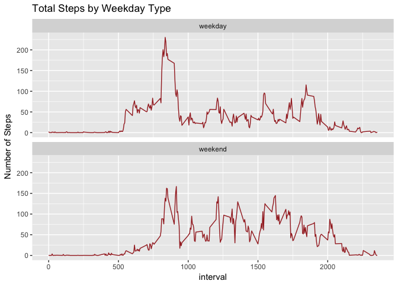

# Reproducible Research: Peer Assessment 1

## Loading and preprocessing the data

```r
setwd("D:/RepData_PeerAssessment1/")
steps <- read.csv("activity.csv")

steps$date <- as.Date(as.character(steps$date))
```

## What is mean total number of steps taken per day?
Histogram of the total number of steps taken each day

```r
library(dplyr)
```

```
## 
## Attaching package: 'dplyr'
```

```
## The following objects are masked from 'package:stats':
## 
##     filter, lag
```

```
## The following objects are masked from 'package:base':
## 
##     intersect, setdiff, setequal, union
```

```r
library(xtable)
```

```
## Warning: package 'xtable' was built under R version 3.3.2
```

```r
steps_total <- steps %>%
  group_by(date) %>%
  summarize(sum = sum(steps))

hist(steps_total$sum, main = "Histogram of Total Number of Daily Steps", xlab = "Total Steps")
```

<!-- -->

The mean total number of steps taken per day

```r
mean_TS <- mean(steps_total$sum, na.rm = TRUE)
mean_TS
```

```
## [1] 10766.19
```

```r
median_TS <- median(steps_total$sum, na.rm = TRUE)
median_TS
```

```
## [1] 10765
```

The mean total number of steps taken per day is 10766.19. The median total number of steps taken per day is 10765.00.

## What is the average daily activity pattern?
Time series plot of 5-minute interval and average number of steps taken

```r
library(ggplot2)
```

```
## Warning: package 'ggplot2' was built under R version 3.3.2
```

```r
s_int <- steps %>%
  group_by(interval) %>%
  summarize(avg_steps = mean(steps, na.rm=TRUE))

ts_int <- ggplot(data=s_int, aes(x=interval, y=avg_steps))  + geom_line() + ggtitle("Average Steps Taken by Interval Across All Days") +xlab("Interval") + ylab("Average Steps")

ts_int
```

<!-- -->

Five-minute interval, on average across all days, with maximum number of steps

```r
max_int <- filter(s_int, avg_steps == max(s_int$avg_steps))
```
Interval 835, with `r round(max_int$avg_steps,2), nsmall=2), steps, has the maximum number of steps, on average across all days in the dataset.


## Imputing missing values

```r
missing_count <- sum(is.na(steps$steps))

missing_count
```

```
## [1] 2304
```
There are 2304 missing values in the dataset. 

Fill in missing values with 5-minute interval mean, and create new dataset with filled in missing values.

```r
steps_mi <- steps %>%
    group_by(interval) %>%
    mutate(meanInt = mean(steps, na.rm=TRUE))

steps_mi$steps <- ifelse(is.na(steps_mi$steps) == TRUE, steps_mi$meanInt, steps_mi$steps)

steps_mi1 <- data.frame(steps_mi[c(1:3)])
```

Histogram of total number of steps taken each day, with imputed missing values. 

```r
steps_mi1.sum <- steps_mi1 %>%
                      group_by(date) %>%
                      summarize(sum = sum(steps))


hist(steps_mi1.sum$sum, main = "Histogram of Total Number of Daily Steps (Imputed Missing Values)", xlab = "Total Steps")
```

<!-- -->

```r
mean_IV_TS <- mean(steps_mi1.sum$sum)
mean_IV_TS
```

```
## [1] 10766.19
```

```r
median_IV_TS <- median(steps_mi1.sum$sum)
median_IV_TS
```

```
## [1] 10766.19
```

```r
mean_var <- mean_TS - mean_IV_TS

median_var <- median_TS - median_IV_TS
```

The mean and median total number of steps taken per day with imputed missing values are:

1. mean: 10766.19
2. median: 10766.19

The mean and median total number of steps taken per day without imputed missing values is 10766.19 and 10765.00, respectively. 

The difference between the mean without imputed values and the mean with imputed values is 0.00. 

The difference between the median without imputed values and the median with imputed values is -1.19. 


## Are there differences in activity patterns between weekdays and weekends?


```r
steps_mi1$weekday <- weekdays(as.Date(steps_mi1$date))

steps_mi1$day_type <- gsub('Saturday|Sunday', 'weekend',steps_mi1$weekday )

steps_mi1$day_type1 <- gsub('Monday|Tuesday|Wednesday|Thursday|Friday', 'weekday',steps_mi1$day_type )

stepsmi1_wd <- steps_mi1 %>% 
          group_by(day_type1, interval) %>%
          summarize(meanint1 = mean(steps))

g01 <- ggplot(stepsmi1_wd, aes(interval, meanint1))
p01 <- g01  + facet_wrap(~ day_type1, nrow=2, ncol=1) + 
  geom_line(color="brown") + ylab("Number of Steps") + 
  labs(title = "Total Steps by Weekday Type") 

p01
```

<!-- -->


